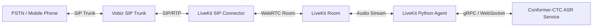

# Deployment Guide: Bilingual Conformer-CTC Large for LiveKit Telephony

This guide details the step-by-step production deployment of the **Bilingual Conformer-CTC Large** (`stt_hi_conformer_ctc_large`) model on AWS, optimized for live voice support (inbound/outbound calls) in the North Indian belt via a Vobiz SIP trunk and LiveKit Rooms.

---

## 1. Why `stt_hi_conformer_ctc_large`?

For real-time telephony (SIP/Vobiz Trunk) serving North India (Hindi, English, Hinglish), **Conformer-CTC Large** is the optimal choice over Whisper or Nemotron because:

1.  **Zero Hallucinations on Noise/Hold Music:** Telephony lines feature background noise, silence, or hold music. Autoregressive models (Whisper/RNN-T) frequently enter infinite repetition loops (hallucinating phrases like *"okay okay okay"*). Since CTC is non-autoregressive, it is mathematically incapable of generating loops or hallucinations on silence.
2.  **Ultra-Low Latency (RTF 0.013):** The model operates at an offline RTF of **0.013** on GPU, translating to a chunk transcription latency of just **49ms**.
3.  **Accent Robustness:** It achieves the lowest zero-shot Word Error Rate (WER) on North Indian dialects in the Lahaja dataset:
    *   **`hindi_belt`:** **18.37% WER**
    *   **`punjab_haryana`:** **19.74% WER**
4.  **Hardware Efficiency:** Due to its lightweight non-autoregressive architecture, you can host **50+ concurrent streaming calls** on a single budget-friendly AWS **g4dn.xlarge** (NVIDIA T4 GPU) or **150+ calls** on a **g5.xlarge** (NVIDIA A10G GPU), reducing hosting costs by 80% compared to Whisper.

---

## 2. Telephony Architecture



---

## 3. Step-by-Step Deployment on AWS

### Step 1: AWS Instance Provisioning
*   **Recommended Instance:** `g5.xlarge` (1x NVIDIA A10G GPU, 24GB VRAM, 4 vCPUs, 16GB RAM) or `g4dn.xlarge` (1x NVIDIA T4 GPU, 16GB VRAM) for cost-efficiency.
*   **Operating System:** Ubuntu 22.04 LTS (Deep Learning AMI recommended).

### Step 2: Install Base Dependencies
Install CUDA, Docker, and Nvidia Container Toolkit to containerize the service:
```bash
# Verify GPU availability
nvidia-smi

# Clone deployment assets
git clone https://github.com/AI4Bharat/NeMo.git -b nemo-v2
cd NeMo
bash reinstall.sh
```

### Step 3: Write the Streaming ASR Service (gRPC/WebSockets)
Below is a high-performance streaming inference wrapper utilizing NeMo's frame-by-frame buffering. Create `asr_server.py`:

```python
import os
import numpy as np
import torch
import nemo.collections.asr as nemo_asr
from nemo.collections.asr.parts.utils.streaming_utils import FrameBuffer

class ConformerCTCStreamingService:
    def __init__(self, model_name="nvidia/stt_hi_conformer_ctc_large"):
        self.device = torch.device("cuda" if torch.cuda.is_available() else "cpu")
        print(f"Loading Conformer-CTC model '{model_name}' on {self.device}...")
        self.model = nemo_asr.models.ASRModel.from_pretrained(model_name)
        self.model = self.model.to(self.device)
        self.model.eval()
        
        # Audio constants
        self.sample_rate = 16000
        self.chunk_size_sec = 0.16  # 160ms chunks
        self.chunk_samples = int(self.sample_rate * self.chunk_size_sec)
        
    def create_session(self):
        """Creates buffers for a new active call stream."""
        return {
            "buffer": FrameBuffer(
                frame_len=self.chunk_samples,
                frame_stride=self.chunk_samples,
                sample_rate=self.sample_rate
            ),
            "state": None
        }

    def process_chunk(self, session, audio_chunk_bytes):
        """Processes 160ms chunk of 16kHz mono 16-bit PCM audio."""
        # Convert raw PCM bytes to float32 numpy array normalized to [-1, 1]
        audio_data = np.frombuffer(audio_chunk_bytes, dtype=np.int16).astype(np.float32) / 32768.0
        
        # Add to frame buffer
        session["buffer"].append(audio_data)
        
        # If enough samples accumulated, transcribe
        if session["buffer"].is_ready():
            frames = session["buffer"].get_frames()
            audio_tensor = torch.tensor(frames, device=self.device).unsqueeze(0)
            audio_len = torch.tensor([frames.shape[0]], device=self.device)
            
            with torch.no_grad():
                log_probs, encoded_len, _ = self.model.forward(
                    input_signal=audio_tensor, input_signal_length=audio_len
                )
                # Decode logits via greedy CTC decoding
                best_paths = log_probs.argmax(dim=-1)
                transcript = self.model.decoding.ctc_decoder_predictions_tensor(
                    best_paths, encoded_len
                )[0]
                return transcript
        return ""
```

---

## 4. LiveKit Agent Integration

To wire this ASR service into LiveKit, build a LiveKit Agent. Telephony audio received in the room from the Vobiz trunk is captured in real-time, forwarded to the ASR service, and transcribed.

Create `livekit_agent.py`:

```python
import asyncio
from livekit.agents import JobContext, WorkerOptions, worker
from livekit.agents.asr import ASR, ASRStream
from asr_server import ConformerCTCStreamingService

# Initialize the model globally to share weights across concurrent rooms
asr_service = ConformerCTCStreamingService()

class LiveKitNeMoCTCASR(ASR):
    def __init__(self):
        super().__init__()
        
    def stream(self) -> ASRStream:
        return NeMoCTCStream()

class NeMoCTCStream(ASRStream):
    def __init__(self):
        super().__init__()
        self._session = asr_service.create_session()
        self._queue = asyncio.Queue()
        
    async def push_frame(self, frame):
        """Receives 16kHz mono audio frames from LiveKit Room."""
        # Convert LiveKit AudioFrame to 16-bit PCM bytes
        pcm_bytes = frame.data.tobytes()
        self._queue.put_nowait(pcm_bytes)
        
    async def _run(self):
        while True:
            try:
                chunk = await self._queue.get()
                if chunk is None:
                    break
                
                # Transcribe chunk
                text = asr_service.process_chunk(self._session, chunk)
                if text:
                    self.callback(text)
            except Exception as e:
                print(f"Error in ASR Stream processing: {e}")
                
async def entrypoint(ctx: JobContext):
    print(f"Call connected. Job room: {ctx.room.name}")
    
    # Connect to LiveKit Room
    await ctx.connect()
    
    # Instantiate custom ASR stream
    custom_asr = LiveKitNeMoCTCASR()
    
    # Bind incoming track subscriber
    @ctx.room.on("track_subscribed")
    def on_track_subscribed(track, publication, participant):
        if track.kind == "audio":
            # Stream audio straight from Vobiz SIP participant to Conformer ASR
            asyncio.create_task(process_participant_audio(track, custom_asr))

async def process_participant_audio(track, asr):
    audio_stream = LiveKitNeMoCTCASR().stream()
    async for frame in track.stream():
        await audio_stream.push_frame(frame)

if __name__ == "__main__":
    worker.run_app(WorkerOptions(entrypoint_fnc=entrypoint))
```

---

## 5. Telephony Production Considerations

1.  **Vobiz Audio Formats:** Telephony streams operate natively at 8kHz G.711 PCMU/A. Since Conformer-CTC requires **16kHz mono audio**, your LiveKit Agent must resample the audio buffer from 8kHz to 16kHz before passing it to the model. LiveKit's Python SDK performs this conversion automatically when requesting audio streams.
2.  **Triton Deployment for Scaling:** For high-scale staging (e.g. 500+ parallel calls), convert the model checkpoints to TensorRT-ASR format and run them on **NVIDIA Triton Inference Server** behind a load balancer. This avoids Python Global Interpreter Lock (GIL) bottlenecks and leverages dynamic hardware batching.
3.  **Out-Of-Vocabulary (OOV) Adaptation:** Conformer-CTC uses a fixed subword vocabulary. If your callers use specific brand names or Hindi dialect slang that is frequently misspelled, you can attach a spelling correction or vocabulary-mapping post-processor (like an n-gram language model or lightweight spellchecker) to the ASR outputs.
